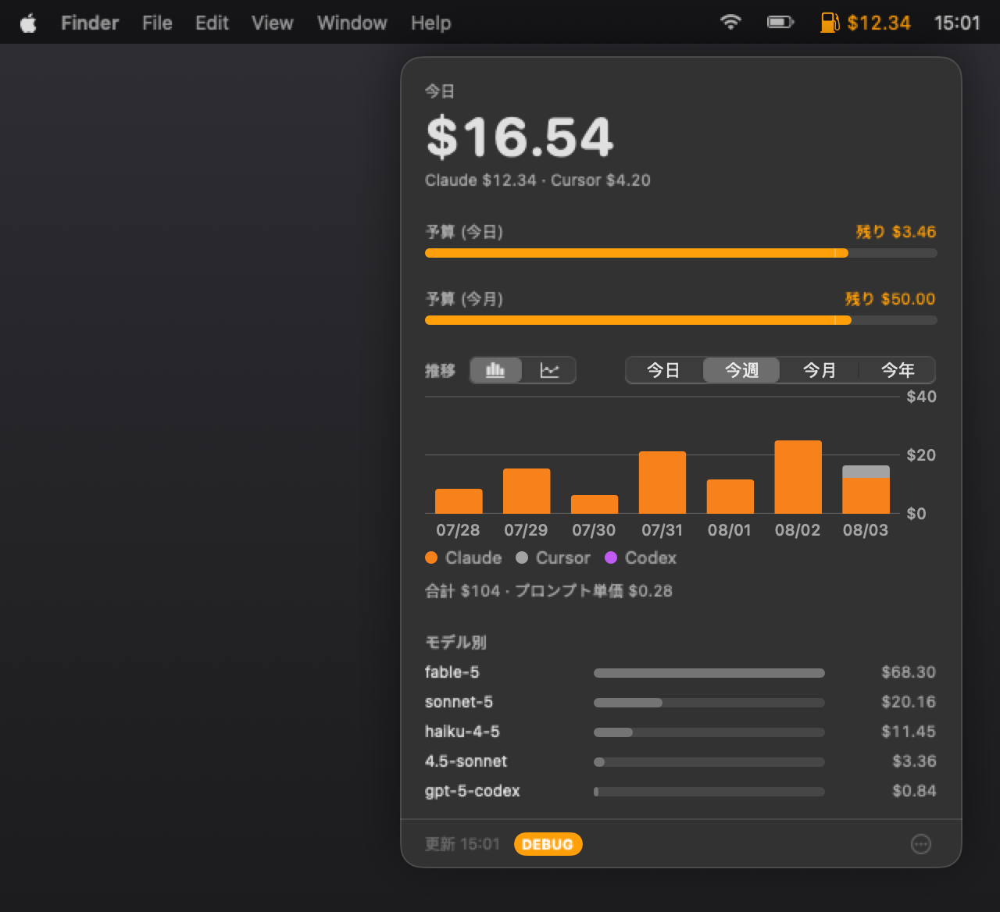

<p align="center">
  
</p>

<h1 align="center">Tokfuel</h1>

<p align="center">
  <strong>See what AI coding costs you — from the menu bar.</strong>
</p>

<p align="center">
  A tiny SwiftUI menu-bar app (⛽️) for macOS.<br/>
  It reads the transcripts Claude Code (and, if present, Codex CLI and Cursor) already write<br/>
  under <code>~/.claude/projects/</code>, <code>~/.codex/sessions/</code>, and Cursor's local database,<br/>
  and shows today's and period cost. Zero setup — everything stays on your Mac.
</p>

<p align="center">
  
  <a href="https://github.com/akidon0000/Tokfuel/actions/workflows/ci.yml"></a>
  <a href="https://github.com/akidon0000/Tokfuel/releases"></a>
</p>

<p align="center">
  <a href="https://tokfuel.github.io/Tokfuel/"><strong>Download for macOS</strong></a> ·
  <a href="README.md">English</a> ·
  <a href="README.ja.md">日本語</a>
</p>

---

<p align="center">
  
</p>

## Features

- 💵 **Cost at a glance**

  Today's / period cost, daily and cumulative charts for today / this week / this month /
  this year (calendar windows; week start is Sat/Sun/Mon in Settings), with a budget
  reference line when the chart matches a calendar-month budget and a month-end pace
  estimate otherwise, per-model breakdown, top sessions, and saving tips — retok's
  Claude analysis plus Cursor-derived ones (model skew, models missing from the price
  table, Cursor's share of the period), each badged with the source it came from.

- 🖱️ **Cursor, too**

  If Cursor is installed and you're signed in, today's Cursor usage is folded into the
  same total and chart via Cursor's own dashboard API (using the session Cursor already
  keeps on disk — nothing to paste). Offline or signed-out, it falls back to local
  token snapshots (often a lower bound on Cursor 3.x) and the popover says so, so a $0
  Cursor figure is never mistaken for "I didn't use it". If the reason is an expired
  sign-in, the popover offers a button that brings Cursor to the front — you sign in there,
  in Cursor's own UI, and Tokfuel picks the new session up. Pricing for the fallback path is
  refreshed once a day from Cursor's published price table.
  Top sessions lists Cursor conversations next to Claude's, estimated from the local
  database (the dashboard API has no per-conversation breakdown).
  In Settings, choose combined / Claude only / Cursor only / Codex only / side-by-side —
  the popover and menu bar both follow that choice (budget gauges still use the included
  sum). "Codex only" appears once Codex CLI is present on the Mac.

- 🤖 **Codex, too**

  If Codex CLI has local session logs (`~/.codex/sessions/`), its cost is estimated
  separately (via the bundled retok script's own Codex pricing) and shown as its own
  color in the daily chart, alongside session and token counts — never merged into
  your Claude total.

- 💳 **Subscription vs. API, and a plan diagnosis**

  Register the plans you actually pay for (Claude / ChatGPT / Cursor) and Tokfuel puts
  your monthly subscription next to what the same usage would have cost on the API,
  so you can see how much the plan saves you against paying per token. The amounts on
  screen are already token counts priced against the API rate card — the only missing
  side was what you actually pay. The **診断 (Diagnose)** button reports how you are
  billed today, what this pace costs per month, what a year of the difference adds up
  to, and the cheapest plan per vendor plus the cheapest overall combination. Preset
  prices are list prices; use *custom* to enter what you are really charged. Both
  sides are estimates: the API equivalent prices recorded token counts against the
  rate card, and plan rate limits cannot be judged from cost alone — never read the
  result as a billed amount. Not paying for any plan is a valid answer too.

- 🚨 **Budgets**

  Independent monthly and daily limits.
  Near a limit the ⛽️ icon turns orange; over it, red — with a heads-up.
  Choose how you get it: a notification, a floating alert window that follows you into
  full-screen Spaces, or both. Either way it fires once, when the level rises.

- 📊 **Menu-bar readout**

  Pick a metric (today, this month, both, prompts) and how to show it
  (amount, percent, ring gauge, ring + percent, icon only) — or the *remaining* budget.
  Percent and gauges measure against your budget limit or your 30-day daily average.
  The gauge is either a ring (beside the ⛽️ icon or replacing it) or the ⛽️ icon itself
  filling bottom-up like a fuel tank — blue inside budget, orange at the threshold, red over.
  Today and this month are coloured independently. Live previews in Settings.

- ⚡ **Keeps up while you work**

  The readout refreshes every 10 minutes when nothing is happening. As soon as today's
  cost moves, it switches to once a minute for the next 5 minutes (extended on every
  further move) and the ⛽️ icon pulses so you can tell it is tracking live. No extra
  network requests. Both the faster refresh and the pulse can be turned off in Settings,
  and the pulse also stops in Low Power Mode or with Reduce Motion enabled.

- 💱 **USD or JPY**

  Budgets and all amounts switch currency.
  Daily rate via [Frankfurter](https://frankfurter.dev).

- 🔄 **In-app updates**

  At launch and then every 24 hours, the app checks
  [GitHub Releases](https://github.com/akidon0000/Tokfuel/releases) for a newer version
  and shows an **Update** button next to the popover's ⋯ menu. One click downloads the
  release, verifies its code signature, swaps the app in place, and relaunches.

- 🔒 **Local-first**

  Prompts and transcripts never leave your Mac. Network calls are: the opt-in
  exchange-rate fetch; the update check against GitHub Releases at launch and every
  24 hours (the release file downloads only when you click update); if Cursor is
  installed, the daily price-table refresh; when signed into Cursor, a usage query to
  Cursor's dashboard API (auth + date range only — no prompts); on **distribution
  builds**, Crashlytics crash reports (no consent prompt); and, only if you opt in,
  anonymous Firebase Analytics for app-UI events. Development builds never configure
  Firebase. Details: [Privacy Policy](docs/PRIVACY.md) · [Terms of Use](docs/TERMS.md).

## Install

1. Download `Tokfuel-x.y.z.dmg` from the [download page](https://tokfuel.github.io/Tokfuel/) or
   [Releases](https://github.com/akidon0000/Tokfuel/releases).
2. Open it and drag `Tokfuel.app` onto `Applications`.
3. Launch it — releases are signed with a Developer ID and notarized by Apple, so it opens
   with no Gatekeeper warning.

**Requirements**

- macOS 14 or later
- `python3` for the cost analysis (ships with the Xcode Command Line Tools)

**Build from source**

```bash
git clone https://github.com/akidon0000/Tokfuel.git
cd Tokfuel
bash scripts/build.sh
```

## Contributing

PRs welcome — see [CONTRIBUTING.md](CONTRIBUTING.md).

- Tests: `swift test`
- Roadmap: [GitHub Issues](https://github.com/Tokfuel/Tokfuel/issues)
- Found a vulnerability? Report it privately — see [SECURITY.md](SECURITY.md).

### Contributors

<div id="contributors">
<!-- readme: contributors -start -->
<table>
	<tbody>
		<tr>
            <td align="center">
                <a href="https://github.com/akidon0000">
                    
                    <br />
                    <sub><b>akidon0000</b></sub>
                </a>
            </td>
            <td align="center">
                <a href="https://github.com/ParkJong-Hun">
                    
                    <br />
                    <sub><b>ParkJong-Hun</b></sub>
                </a>
            </td>
		</tr>
	</tbody>
</table>
<!-- readme: contributors -end -->
</div>

## Acknowledgements

- **Cost analysis** — [retok](https://github.com/d-date/retok), bundled unmodified.
  © [Daiki Matsudate (@d-date)](https://github.com/d-date), [MIT License](Tokfuel/Sources/Resources/LICENSE-retok).
- **App icon** — designed with [Icon Composer](https://developer.apple.com/documentation/xcode/creating-your-app-icon-using-icon-composer);
  the source document lives in [Tokfuel/icon](https://github.com/Tokfuel/icon).
- **Exchange rates** — [Frankfurter](https://frankfurter.dev).
- **Roadmap conventions** — adapted from [bajutsu](https://github.com/bajutsu-e2e/bajutsu)'s issue-driven development workflow.

## License

[MIT](LICENSE) © [Dan Akiyama (@akidon0000)](https://github.com/akidon0000).
